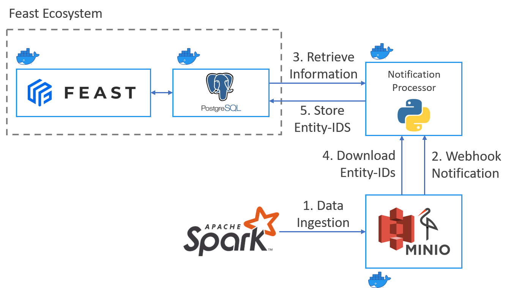
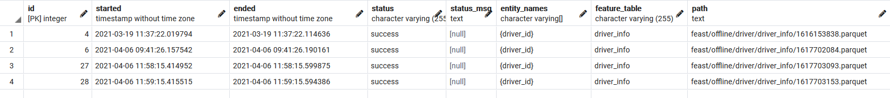
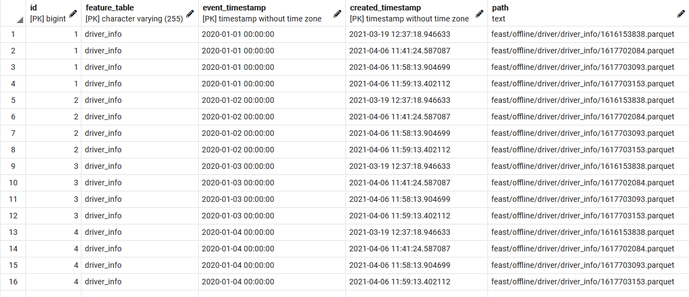
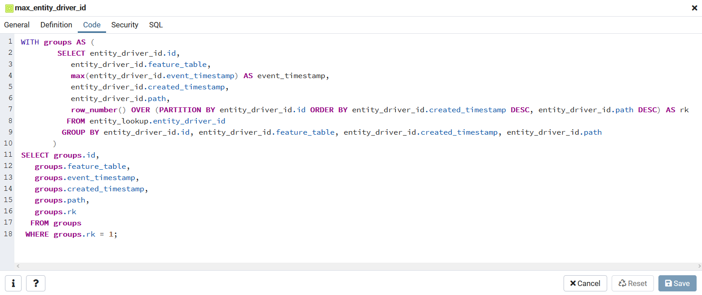
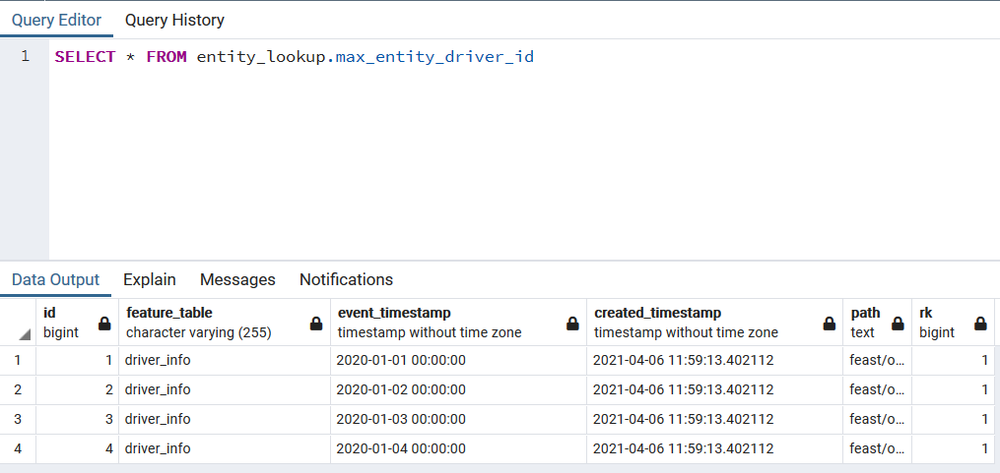

<h1 align="center">
	
</h1>

<h3 align="center">
	An extension for the Machine Learning Feature Store <a href="https://feast.dev/" target="_blank">Feast</a> to support feature retrieval from MinIO without knowing the exact Entity-IDs.<br>
	Info: This repository supports only older versions of Feast before the redesign.
</h3>

<p align="center">
    
    
    
</p>

<p align="center">
  <a href="#addressed-issues">Addressed Issues</a> •
  <a href="#target-group">Target Group</a> •
  <a href="#architecture">Architecture</a> •
  <a href="#setup">Setup</a> •
  <a href="#todos">ToDos</a>
</p>

# Addressed Issues
This repo addresses the limitation of Feast regarding the necessity to specify the entity identifiers when retrieving features either from the offline store or the online store. In many use cases I encountered, I did not know the identifiers. This concerns the following scenarios:
-  Batch prediction
-  Model training

Additionally, I wanted to define a timespan for the event timetamp of an entity identifier (e.g. "give me all features for entity identifiers with an event timestamp between 2020-01-01 and 2020-12-31").

-> See similar [issue](https://github.com/feast-dev/feast/issues/1361)

# Target Group
This repo is for engineers who encountered the same problems as described and use MinIO in their Feast-Setup as their offline feature store for .parquet-files. This system is supposed to run parallel to your Kubernetes- or Docker-Compose-Feast-Setup. It is not necessary to use feast-entity-store with the local standalone Python-Version as you can use SQL-Queries to retrieve entity identifiers (as of Version 0.10).

# Architecture



1. The data gets manually/automatically ingested as a parquet-file in the S3-storage
2. The S3-ingestion triggers a webhook notification
3. The notification processor retrieves specific information regarding the ingested data:
   1. entity_names
   2. entity_types
   3. feature_table
   4. timestamp_column (event timestamp)
   5. created_timestamp_column
4. The notification processor downloads the entities via S3 Select SQL
5. The notification processor joins and stores the information 
   - into the `entity_lookup.job` table:
     - started
     - ended
     - status
     - status_msg
     - entity_names
     - feature_table
     - path
   - in a `entity_lookup.entity-<name>` table:
     - id
     - feature_table
     - event_timestamp
     - created_timestamp
     - path (S3 path to parquet file)
# Setup

## 1. Create entity_store_config.yaml
- Copy `config/entity_store_config-template.yaml` to `config/entity_store_config.yaml`
- Change the following configuration according to your environment (in these examples I use the port 12346 for the Flask webserver. You can change it in the docker- and config-files)
    ```yaml
    flask:
        host: 0.0.0.0
        port: 12346
    minio:
        endpoint_url: http://<minio-ip>:<minio-port>
        aws_access_key_id: <access-key>
        aws_secret_access_key: <secret-access-key>
    webhook:
        tokens:
            - <token>
    postgres:
        host: <postgres-ip>
        port: <postgres-port>
        database: <postgres-db>
        user: <postgres-user>
        password: <postgres-pw>
    ```

## 2. Configure Minio
- Enable MinIO webhooks (see [notification guide](https://docs.min.io/docs/minio-bucket-notification-guide.html#webhooks)) - docker-compose example:
    ```yaml
    minio:
        restart: always
        image: minio/minio:latest
        container_name: feast_minio
        environment:
            - MINIO_ROOT_USER=${AWS_ACCESS_KEY_ID:-access_key}
            - MINIO_ROOT_PASSWORD=${AWS_SECRET_ACCESS_KEY:-secret_key}
            - MINIO_NOTIFY_WEBHOOK_ENABLE=on
            - MINIO_NOTIFY_WEBHOOK_ENDPOINT=http://<ip>:12346/minio/events
            - MINIO_NOTIFY_WEBHOOK_AUTH_TOKEN=<token>
            - MINIO_NOTIFY_WEBHOOK_QUEUE_DIR=/queue
            - MINIO_API_SELECT_PARQUET=on
        volumes:
            - ./minio/data:/data:Z
            - ./minio/queue:/queue:Z
        ports:
            - "${MINIO_PORT:-19001}:9000"
        command: server /data
    ```
- Set a specific bucket notification for create-/delete-operations with .parquet-files: `python setup/set_bucket_notification.py`
## 3a. Setup feast-entity-store with a standalone Docker-Container
1. Build image (example with proxy):
    - `docker build --pull --rm -f "Dockerfile" -t feast-entity-store:latest --build-arg HTTP_PROXY=http://<proxy>:8080/ --build-arg HTTPS_PROXY=http://<proxy>:8080/ .`
2. Run container:
   - `docker run --rm -it -v $PWD/config/entity_store_config.yaml:/app/entity_store/entity_store_config.yaml -p 12346:12346 feast-entity-store:latest`

## 3b. Integrate feast-entity-store in the Feast-Docker-Compose-Setup
1. Create a directory for your docker-compose that contains the necessary files
2. Copy config, src, Dockerfile and .dockerignore to the created directory
    ```
    entity_store
    │   .dockerignore
    │   Dockerfile
    │
    ├───config
    │       entity_store_config.yaml
    │
    └───src
        │   receive_bucket_notification.py
        │
        └───connectors
            │   postgres_connector.py
            │   s3_connector.py
    ```
3. Create a service for the python application
    ```yaml
    entity_store:
        restart: on-failure
        build: ./entity_store
        image: feast-entity-store
        container_name: feast-entity-store
        volumes:
            - ./entity_store/config/entity_store_config.yaml:/app/config/entity_store_config.yaml
        ports:
            - 12346:12346
    ```

## Result
| The `jobs` table contains all successful and failed attempts to write the entity-ids |     An entity table in the `entity_lookup` schema is being created and populated      |    A view to access the latest entitiy-ids is being created     |                 The view can be queried nearly effortless                  |
| :----------------------------------------------------------------------------------: | :-----------------------------------------------------------------------------------: | :-------------------------------------------------------------: | :------------------------------------------------------------------------: |
|       |  |  |  |


# ToDos
-  Handle delete operations by removing the corresponding entries from the entity tables
